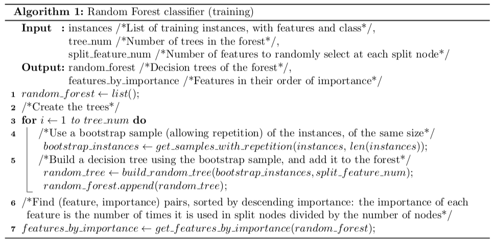
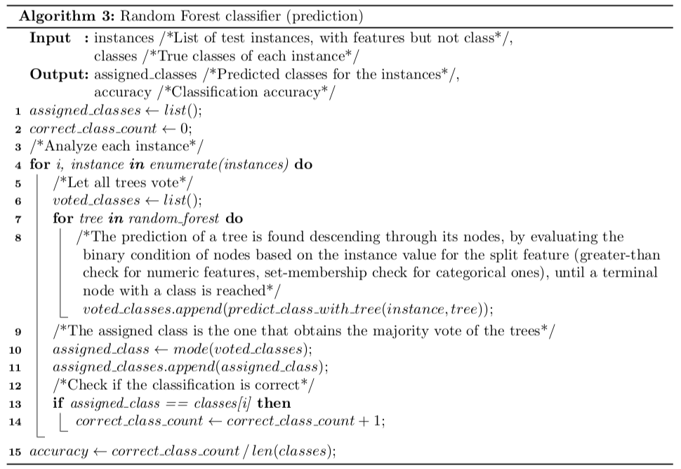

# Random Forest Classifier

The Random Forest classifier was introduced by Leo Breiman from University of California in 2001 [1]. The innovative characteristic of this algorithm is the usage of a set of decision trees that consider only a random subset of features for each split node, and classify new instances according to the majority vote of each tree.

The objective of this work is the evaluation of the a custom implementation of Random Forest for classification tasks using different combinations of hyper-parameters, applied it to 5 data sets of different sizes and features. The accuracy of each trained model is computed, as well as the importance of each feature.

[1] Breiman L. (2001). Random Forests. Machine Learning, 45(1), 5-32.

| | |
|-|-|
| **Author** | Albert Espín |
| **Date**  | April 2019  |
| **Report license**  | Creative Commons Attribution, Non-Commercial, Non-Derivative |

## Main pseudo-codes

